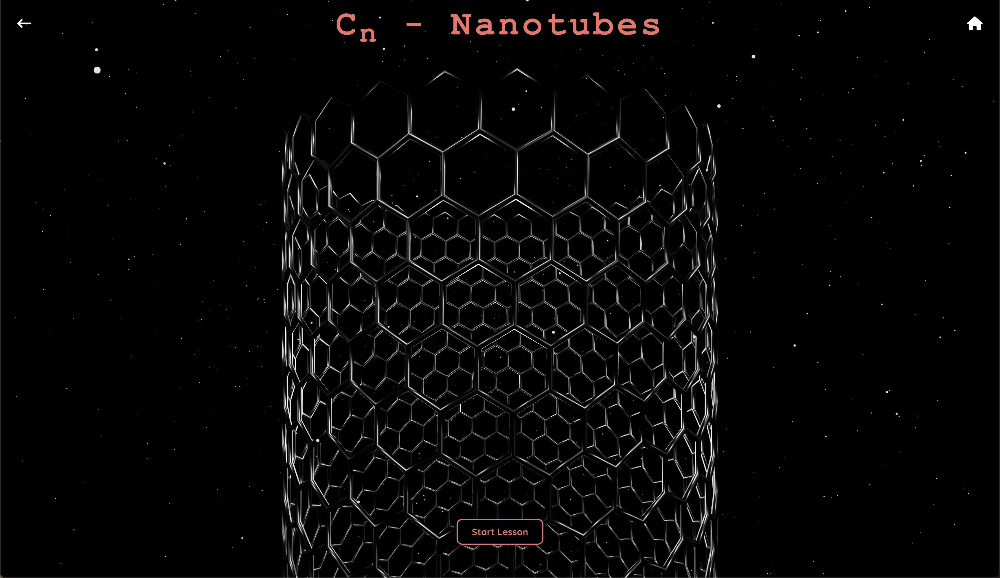
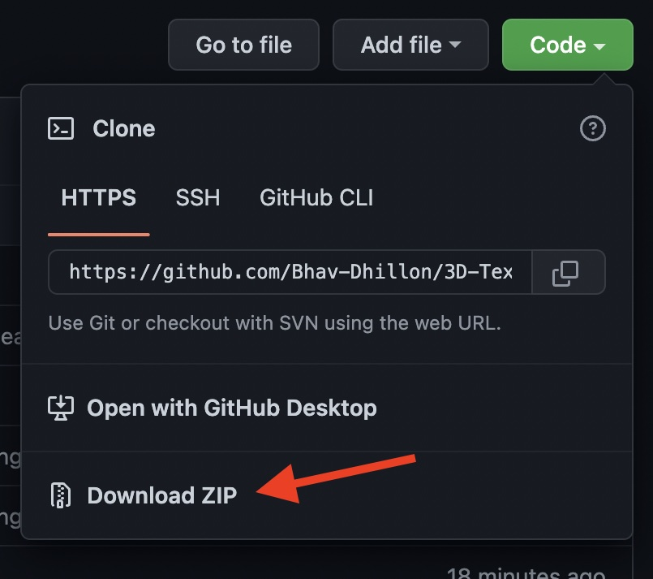

# 3D Textbook

### Project Description:
- Six Protons is a web application, specifically it is an eLearning minimum viable product (mvp). It is designed to teach math & science by visualizing abstract concepts using 3D models. The app in its current form focuses on carbon crystals (carbon is the only atom with 6 protons), however this framework can be applied to teach any STEM subject. 
### Live Build: 
- [https://6protons.app](https://6protons.app)

## Application Structure:
### File System:
```
    .
    └── 3D-Textbook-master/
        ├── node_modules
        ├── public/
        │   ├── lesson1_models/
        │   │   ├── model0.glb
        │   │   ├── model2.glb
        │   │   ├── model3.glb
        │   │   ├── model4.glb
        │   │   └── model5.glb
        │   ├── lesson2_models/
        │   │   └── model0.glb
        │   ├── lesson3_models/
        │   │   └── model0.glb
        │   ├── lesson4_models/
        │   │   └── model0.glb
        │   └── home_models/
        │       └── steroid.glb
        ├── src/
        │   ├── components/
        │   │   ├── HomeNav.jsx
        │   │   ├── LessonNav.jsx
        │   │   └── Stars.jsx
        │   ├── images/
        │   │   ├── diamond.png
        │   │   ├── download-readme.jpg
        │   │   ├── fullerene.jpeg
        │   │   ├── graphene.jpg
        │   │   └── nanotube.jpeg
        │   ├── pages/
        │   │   ├── diamonds_lesson/
        │   │   │   ├── DiamondModels.jsx
        │   │   │   ├── DiamondLesson.jsx
        │   │   │   └── DiamondText.jsx
        │   │   ├── fullerenes_lesson/
        │   │   │   ├── FullereneModels.jsx
        │   │   │   ├── FullereneLesson.jsx
        │   │   │   └── FullereneText.jsx
        │   │   ├── graphene_lesson/
        │   │   │   ├── GrapheneLesson.jsx
        │   │   │   ├── GrapheneModels.jsx
        │   │   │   └── GrapheneText.jsx
        │   │   ├── home/
        │   │   │   ├── Card.jsx
        │   │   │   ├── homes-stles.css
        │   │   │   ├── Home.jsx
        │   │   │   └── Models.jsx
        │   │   └── nanotubes_lesson/
        │   │       ├── NanotubeModels.jsx
        │   │       ├── NanotubesLesson.jsx
        │   │       └── NanotubeText.jsx
        │   ├── redux/
        │   │   ├── actions/
        │   │   │   └── index.js
        │   │   ├── reducers/
        │   │   │   └── index.js
        │   │   └── store.js
        │   ├── App.jsx
        │   ├── global-styles.css
        │   └── index.js
        ├── package-lock.json
        ├── package.json
        ├── README.md
        └── .gitignore
```

### Architecture:
Six Protons is built as a single page web application. This design allows for the application to be run on any browser, making the app inherently cross platform. The app runs well on desktops, laptops, and tablets, casting a wide net for users of all types.

### User Interface Screenshots:




### Built With:
- React (JavaScript)
    - To render and update the DOM based on changes in application state. 
- Redux
    - To pass data between sibling components and synchronize state across components.
- Blender
    - To create 3D assets. 
- Three.JS / React-3-Fiber
    - To import, render, and animate 3D assets.


## Development Environment Set-up:
These instructions will get you a copy of the project up and running on your local machine for development and testing purposes.

Instructions:
1. Download the source code by clicking the green "code" button at the top of this README file and click "Download Zip"  

    <!--  -->

    


2. Next, using the command line, naviagate to the project directory.
    ```bash
    cd 3D-Textbook-master
    ``` 
3. Once you're in the project directory, install dependencies with:
    ```bash
    npm install
    ``` 
4. After dependecies have finished installing, boot up a development server from the terminal with the following command: 
    ```bash
    npm start
    ``` 
5. Happy hacking!


## Authors:
- B. Dhillon - Designer && Developer

## License:
```
Six Protons (https://6protons.app)
Copyright (c) 2022, Bhavandeep Dhillon

Six Protons is free software: you can redistribute it and/or modify
it under the terms of the GNU General Public License as published by
the Free Software Foundation, specifically version 3 of the License.

Six Protons is distributed in the hope that it will be useful,
but WITHOUT ANY WARRANTY; without even the implied warranty of
MERCHANTABILITY or FITNESS FOR A PARTICULAR PURPOSE.  See the
GNU General Public License for more details.

You should have received a copy of the GNU Affero General Public License
along with Six Protons.  If not, see <http://www.gnu.org/licenses/>.
```
## Acknowledgements:
Special thanks to the open source developer collective, Poimandres. For their development of the incredible React renderer for Three.js (react-three-fiber) as well as their useful GLTF to JSX transformer (gltfjsx).
