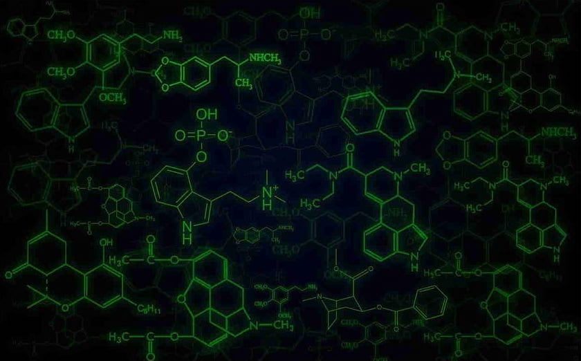
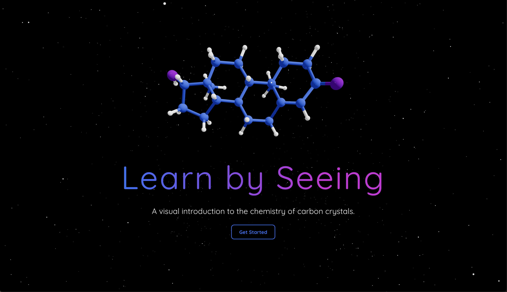
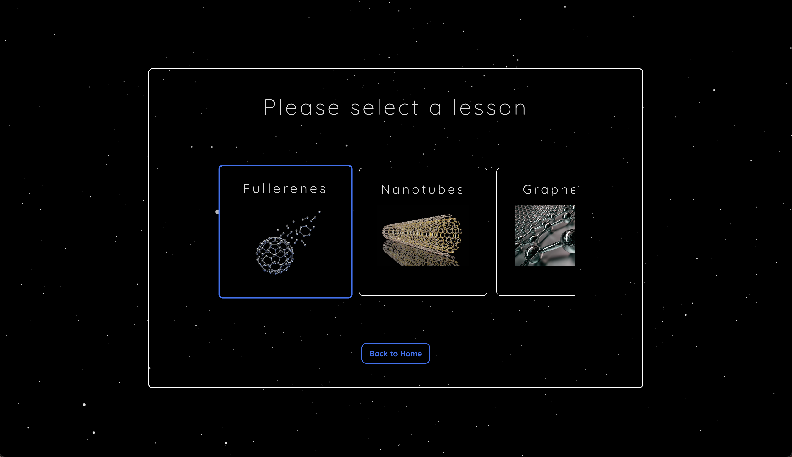
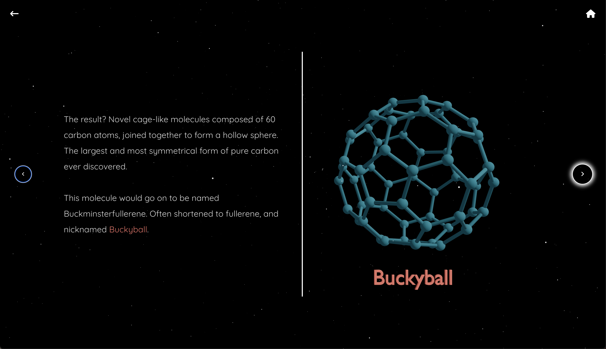

# 6 Protons

### Project Description:
- Six Protons is a VR minimum viable product. It is designed to teach organic chemistry via visualizing concepts using interactive 3D models embedded in a virtual universe. The project in its current form focuses on organic chemistry (carbon is the only atom with 6 protons) however, this software is capable of creating a 3D lesson to teach any STEM subject. The application is under development and currently being re-written. 

<p align="center">
    
</p>


## Application Structure:
### File System:
```
    .
    └── 3D-Textbook-master/
        ├── node_modules
        ├── public/
        │   ├── lesson1_models/
        │   │   ├── model0.glb
        │   │   ├── model2.glb
        │   │   ├── model3.glb
        │   │   ├── model4.glb
        │   │   └── model5.glb
        │   ├── lesson2_models/
        │   │   └── model0.glb
        │   ├── lesson3_models/
        │   │   └── model0.glb
        │   ├── lesson4_models/
        │   │   └── model0.glb
        │   └── home_models/
        │       └── model0.glb
        ├── src/
        │   ├── components/
        │   │   ├── HomeNav.jsx
        │   │   ├── LessonNav.jsx
        │   │   └── Stars.jsx
        │   ├── images/
        │   │   ├── diamond.png
        │   │   ├── download-readme.jpg
        │   │   ├── fullerene.jpeg
        │   │   ├── graphene.jpg
        │   │   └── nanotube.jpeg
        │   ├── pages/
        │   │   ├── diamonds_lesson/
        │   │   │   ├── DiamondModels.jsx
        │   │   │   ├── DiamondLesson.jsx
        │   │   │   └── DiamondText.jsx
        │   │   ├── fullerenes_lesson/
        │   │   │   ├── FullereneModels.jsx
        │   │   │   ├── FullereneLesson.jsx
        │   │   │   └── FullereneText.jsx
        │   │   ├── graphene_lesson/
        │   │   │   ├── GrapheneLesson.jsx
        │   │   │   ├── GrapheneModels.jsx
        │   │   │   └── GrapheneText.jsx
        │   │   ├── home/
        │   │   │   ├── Card.jsx
        │   │   │   ├── homes-stles.css
        │   │   │   ├── Home.jsx
        │   │   │   └── Models.jsx
        │   │   └── nanotubes_lesson/
        │   │       ├── NanotubeModels.jsx
        │   │       ├── NanotubesLesson.jsx
        │   │       └── NanotubeText.jsx
        │   ├── redux/
        │   │   ├── actions/
        │   │   │   └── index.js
        │   │   ├── reducers/
        │   │   │   └── index.js
        │   │   └── store.js
        │   ├── App.jsx
        │   ├── global-styles.css
        │   └── index.js
        ├── package-lock.json
        ├── package.json
        ├── README.md
        └── .gitignore
```

## Data Architecture:

## Rendering Pattern: 
SPA with server side rendering & hydration. 

## Stack:
- TypeScript
- React
- Next
- WebGL 


## User Interface (stills) :





## Demo:

##### UI is responsive and scalable:
https://user-images.githubusercontent.com/88413313/190004640-e058fe2b-e85b-453f-bf7c-51be5e2a056b.mp4

##### And works with tablets as well: 
https://user-images.githubusercontent.com/88413313/190005139-403e5162-d019-4523-8d03-f6aa2287a619.mp4


## Dev Environment Set-up:
These instructions will get you a copy of the project up and running on your local machine for development and testing purposes.

Instructions:
1. Download the source code by clicking the green "code" button at the top of this README file and click "Download Zip"  

    <!--  -->

    


2. Next, using the command line, naviagate to the project directory.
    ```bash
    cd 3D-Textbook-master
    ``` 
3. Once you're in the project directory, install dependencies with:
    ```bash
    npm install
    ``` 
4. After dependecies have finished installing, boot up a development server from the terminal with the following command: 
    ```bash
    npm start
    ``` 
5. Happy hacking.
